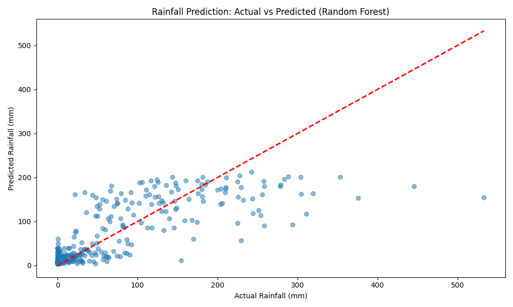
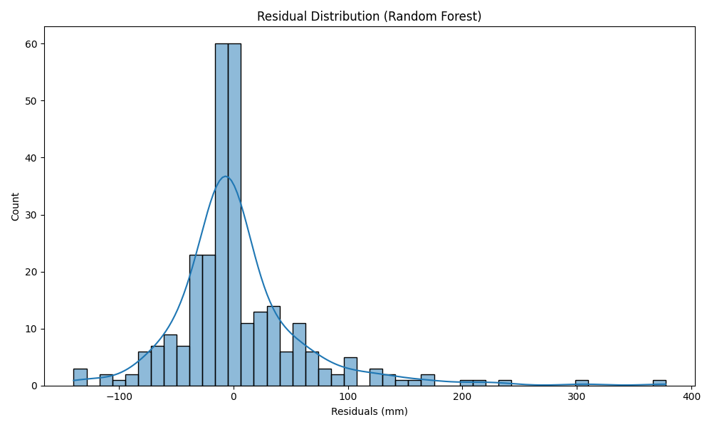
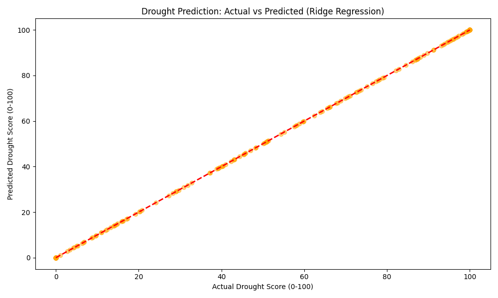
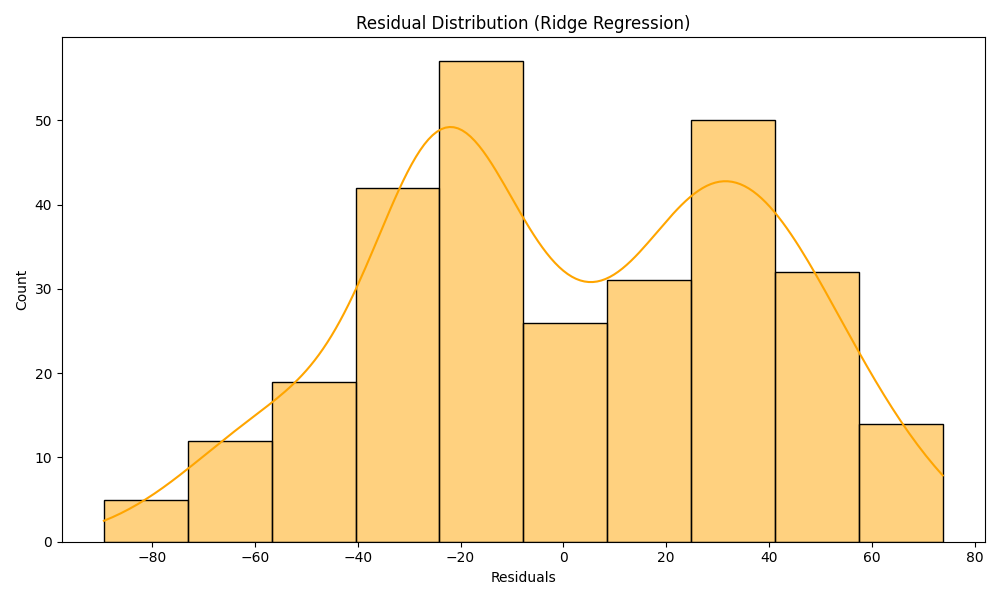
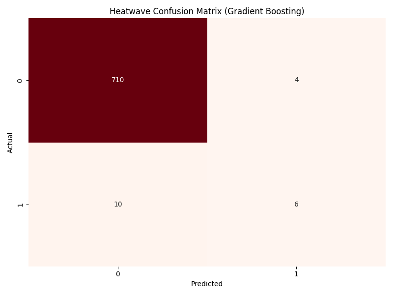
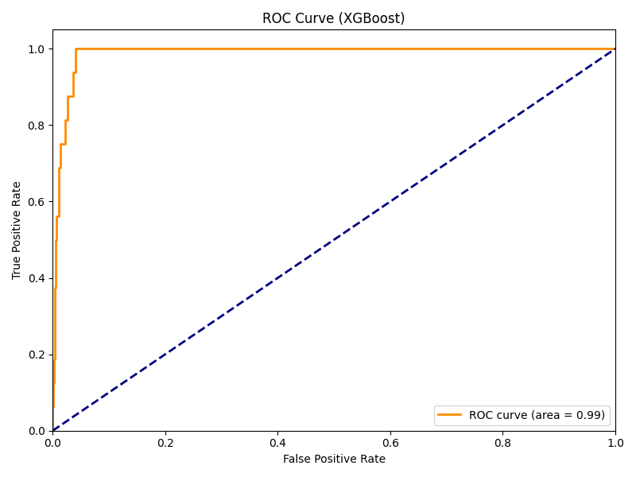
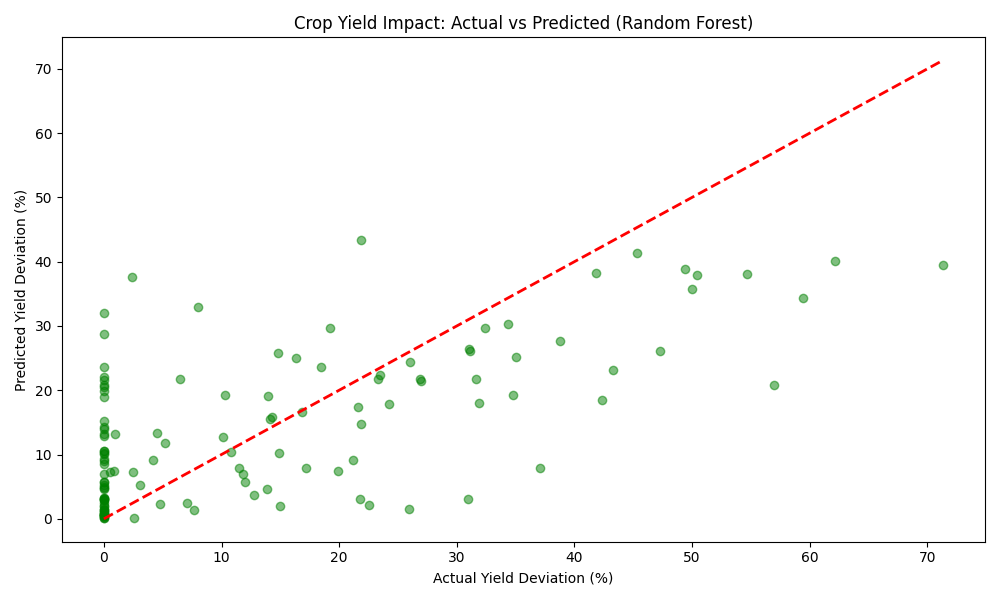
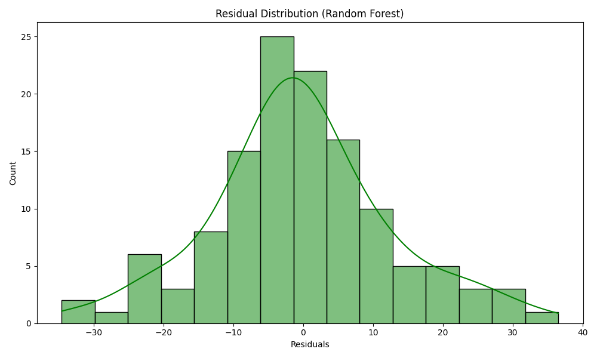

# Climate AI

AI-driven **Climate Vulnerability Assessment** for Hyderabad/Telangana: rainfall, drought, heatwave, and crop impact predictions. This document walks through datasets, EDA, feature engineering, model selection, API, and dashboard integration.

---

## 1. Project Overview

| Component | Description |
|-----------|-------------|
| **Scope** | Hyderabad / Telangana (Deccan region) |
| **Models** | 4: Rainfall (regression), Drought (regression), Heatwave (classification), Crop Impact (regression) |
| **Method** | Multi-Model: 3 candidates per task, 80/20 train/test, best model by R² or F1 |
| **Serving** | FastAPI backend; dashboard at `/`; API docs at `/docs` |

---

## 2. Dataset Details
| Model | Source | Path | Records / Period |
|-------|--------|------|-------------------|
| **Rainfall** | IMD historical | `data/hyderabad_rainfall_data.csv` | 121 years (1901–2021), monthly |
| **Drought** | Derived from same IMD rainfall | Same file + deficit/LPA logic | Monthly, 1970–2022 |
| **Heatwave** | Open-Meteo Historical API | `data/hyderabad_temperature.csv` | Daily max temp + humidity |
| **Crop Impact** | Kaggle India Crop Yield | `data/crop_yield_india.csv` | 1997–2020; states: AP, Telangana, Karnataka; |

--- 
**Rainfall data shape (after melt):** One row per year-month; columns include `Year`, month names (Jan–Dec), `Total`.

```python
# From utils/data_loader.py — load and melt to monthly
df = pd.read_csv("data/hyderabad_rainfall_data.csv")
months = ['Jan', 'Feb', 'Mar', 'April', 'May', 'June', 
          'July', 'Aug', 'Sept', 'Oct', 'Nov', 'Dec']
records = []
for _, row in df.iterrows():
    for i, month in enumerate(months):
        if month in row:
            records.append({'year': row['Year'], 'month': i + 1, 'rainfall': row[month]})
monthly_df = pd.DataFrame(records).sort_values(['year', 'month'])
```

---

## 3. EDA & Basic Stats

### 3.1 Rainfall

- **Mean monthly rainfall:** ~65.4 mm  
- **Std dev:** ~84.8 mm  
- **Distribution:** Right-skewed; Southwest Monsoon (Jun–Sep) contributes ~80% of annual precipitation.

```python
# After loading monthly_df
monthly_df['rainfall'].describe()
# Monsoon months (6,7,8,9) vs rest
monsoon = monthly_df[monthly_df['month'].isin([6,7,8,9])]['rainfall']
non_monsoon = monthly_df[~monthly_df['month'].isin([6,7,8,9])]['rainfall']
print(monsoon.mean(), non_monsoon.mean())  # illustrates seasonal split
```
---
### 3.2 Drought

- **Mean drought score:** ~32/100  
- **Correlation:** Strong (e.g. ~0.88) between sustained 6‑month deficit and agricultural impact  
- **Periodicity:** Drought events roughly every 5–7 years

### 3.3 Heatwave

- **Class balance:** Heatwave days &lt; ~3% (rare event)  
- **Pattern:** Extreme heat often follows humidity drop below ~20%

### 3.4 Crop Impact

- **Mean yield deviation:** ~−4.5% in deficit years  
- **Variance:** High across states; irrigation in Telangana partly mitigates risk

---

## 4. Feature Engineering

### 4.1 Rainfall

- **Temporal lags:** 1, 2, 3, 12 months (autocorrelation + yearly cycle)   
- **Rolling:** 3‑month average on *shifted* rainfall


```python
# utils/data_loader.py — Rainfall features
monthly_df['lag_1'] = monthly_df['rainfall'].shift(1)
monthly_df['lag_2'] = monthly_df['rainfall'].shift(2)
monthly_df['lag_3'] = monthly_df['rainfall'].shift(3)
monthly_df['lag_12'] = monthly_df['rainfall'].shift(12)
monthly_df['month_sin'] = np.sin(2 * np.pi * monthly_df['month'] / 12)
monthly_df['month_cos'] = np.cos(2 * np.pi * monthly_df['month'] / 12)
monthly_df['rolling_3'] = monthly_df['rainfall'].shift(1).rolling(3).mean()
```
---
### Actual vs Predicted


--- 
### Error Distribution (Residuals)


---

### 4.2 Drought

- **Rolling:** 3‑month and 6‑month rainfall averages  
- **Deficit %:** Deviation from long-period average (LPA) per month  
- **Persistence:** Previous year drought (lag 12 of deficit)  
- **Monsoon strength:** Scaled index (0–2) from 4‑month rolling sum vs monsoon normal  

```python
# utils/data_loader.py — Drought features
df_melted['rolling_3mo'] = df_melted['Rainfall'].rolling(window=3, min_periods=1).mean()
df_melted['rolling_6mo'] = df_melted['Rainfall'].rolling(window=6, min_periods=1).mean()
monthly_normals = df_melted.groupby('Month')['Rainfall'].transform('mean')
df_melted['deficit_pct'] = (df_melted['normal_rainfall'] - df_melted['Rainfall']) / df_melted['normal_rainfall'] * 100
df_melted['prev_year_drought'] = df_melted['deficit_pct'].shift(12)
```
---

### Actual vs Predicted


---

### Error Distribution (Residuals)


---

### 4.3 Heatwave

- **Lags:** Max temp 1, 2, 3 days  
- **Rolling:** 7‑day average max temp  
- **Cyclic month:** sin/cos  
- **Target:** `is_heatwave` = (max temp ≥ 40°C) OR (anomaly ≥ 4.5°C)

```python
# utils/data_loader.py — Heatwave features
df['temp_max_lag1'] = df['temp_max'].shift(1)
df['temp_max_lag2'] = df['temp_max'].shift(2)
df['temp_max_lag3'] = df['temp_max'].shift(3)
df['temp_max_7day_avg'] = df['temp_max'].rolling(window=7).mean()
df['month_sin'] = np.sin(2 * np.pi * df['month'] / 12)
df['month_cos'] = np.cos(2 * np.pi * df['month'] / 12)
df['is_heatwave'] = ((df['temp_max'] >= 40) | (df['temp_anomaly'] >= 4.5)).astype(int)
```

---
### Confusion Matrix


---

### ROC Curve


---

### 4.4 Crop Impact

- **Climate:** Rainfall, rainfall anomaly %  
- **Inputs:** Fertilizer and pesticide per area (kg/ha)  
- **Categorical:** Crop, State, Season (label‑encoded)
---


---
### Error Distribution (Residuals)


---

## 5. Model Selection & Training

- **Split:** 80/20; rainfall uses **temporal** (no shuffle); drought/heatwave/crop use random (heatwave stratified).  
- **Selection:** Best by R² for regression, F1 for heatwave.  
- **Tuning:** GridSearchCV (e.g. `n_estimators`, `max_depth` for RF/GBM; `alpha` for Ridge; `C` for Logistic/SVR).

```python
# models/rainfall/experiment_rainfall.py — Champion/Challenger loop
X_train, X_test, y_train, y_test = train_test_split(X, y, test_size=0.2, shuffle=False)
models = {
    "Linear Regression": {"model": LinearRegression(), "params": {}},
    "Random Forest": {"model": RandomForestRegressor(...), "params": {"n_estimators": [50,100,200], "max_depth": [None,10,20]}},
    "Gradient Boosting": {"model": GradientBoostingRegressor(...), "params": {...}}
}
for name, config in models.items():
    if config["params"]:
        search = GridSearchCV(config["model"], config["params"], cv=3, scoring='r2')
        search.fit(X_train, y_train)
        model = search.best_estimator_
    # evaluate on X_test, keep best by R²
joblib.dump(best_model, "models/rainfall/best_model.joblib")
```
---

| Model | Winner | Primary metric |
|-------|--------|----------------|
| Rainfall | Random Forest | R² 0.5676 |
| Drought | Ridge Regression | R² 1.00 |
| Heatwave | Gradient Boosting | F1 0.46 |
| Crop Impact | Random Forest | R² 0.44 |

---

## 6. Testing & Metrics

### 6.1 Rainfall

| Model | R² | RMSE | MAE |
|-------|-----|------|-----|
| Linear Regression | 0.5484 | 60.46 | 38.03 |
| **Random Forest** | **0.5676** | **59.16** | **35.85** |
| Gradient Boosting | 0.5338 | 61.43 | 38.69 |

Interpretation: Captures monsoon peaks well; higher variance in dry spells or localized extremes.

---
### 6.2 Drought

| Model | R² | RMSE | MAE |
|-------|-----|------|-----|
| **Ridge Regression** | **1.0000** | 0.00 | 0.00 |
| SVR | 1.0000 | 0.08 | 0.08 |
| Random Forest | 1.0000 | 0.12 | 0.06 |

### 6.3 Heatwave

| Model | Accuracy | F1 |
|-------|----------|-----|
| Logistic Regression | 0.9014 | 0.25 |
| Random Forest | 0.9795 | 0.44 |
| **Gradient Boosting** | **0.9808** | **0.4615** |

Interpretation: High accuracy from class imbalance.

---
### 6.4 Crop Impact

| Model | R² | RMSE | MAE |
|-------|-----|------|-----|
| Lasso | 0.15 | 15.88 | 12.70 |
| Decision Tree | 0.28 | 14.65 | 10.55 |
| **Random Forest** | **0.4396** | **12.92** | **9.59** |

---

## 7. Hyperparameter Tuning & Improvements

| Model | Next steps |
|-------|------------|
| **Rainfall** | Add ENSO/IOD indices; try XGBoost or LSTM for multi‑step forecast. |
| **Drought** | Add satellite SMI/NDVI for real‑time moisture/vegetation. |
| **Heatwave** | SMOTE for class balance; add wind and pressure anomalies. |
| **Crop** | NDVI; pest/market variables. |

Re-run experiments:  
`python models/rainfall/experiment_rainfall.py` (and similarly `experiment_drought.py`, `experiment_heatwave.py`, `experiment_crop.py`).

---

## 8. API Details

- **Base:** FastAPI; interactive docs at `GET /docs`.  
- **Models:** Loaded from `models/<name>/best_model.joblib`; preprocessing (scaling/encoding) is in pipelines or applied in endpoints.

| Endpoint | Method | Purpose |
|----------|--------|---------|
| `/` | GET | Serves dashboard (index.html) |
| `/predict_rainfall` | POST | Monthly rainfall (mm) and risk category |
| `/predict_drought` | POST | Drought score 0–100 and category |
| `/predict_heatwave` | POST | Binary heatwave + probability |
| `/predict_crop_impact` | POST | Yield deviation % and impact category |

---
### Request / response (concise)

- **Rainfall:** `lag_1`, `lag_2`, `lag_3`, `lag_12` (float), `month` (1–12). Response: `predicted_rainfall_mm`, `risk_category` (e.g. High Risk (Flooding), Normal, Low Risk (Drought)).  
- **Drought:** `rolling_3mo_avg`, `rolling_6mo_avg`, `deficit_pct`, `prev_year_drought`, `monsoon_strength`. Response: `drought_score`, `category` (No/Mild/Moderate/Severe/Extreme Drought).  
- **Heatwave:** `max_temp_lag1`, `max_temp_lag2`, `max_temp_lag3`, `humidity`, `month`. Response: `is_heatwave`, `heatwave_probability`.  
- **Crop:** `crop_type`, `state`, `season`, `rainfall`, `rainfall_anomaly`, `fertilizer_per_area`, `pesticide_per_area`. Response: `yield_deviation_pct`, `impact_category`, `available_crops`.

---

## 9. Real Testing Examples & Expected Results

### Rainfall

| Scenario | Input (excerpt) | Expected |
|----------|------------------|----------|
| Monsoon peak (July) | `lag_1=150, lag_2=100, lag_3=80, lag_12=200, month=7` | High rainfall (150–250 mm), monsoon peak |
| Winter dry (Dec) | `lag_1=10, lag_2=20, lag_3=50, lag_12=5, month=12` | Low rainfall (&lt;30 mm) |
| Pre‑monsoon (May) | `lag_1=30, lag_2=10, lag_3=5, lag_12=25, month=5` | Low–moderate (20–60 mm) |

---
### Heatwave

| Scenario | Input (excerpt) | Expected |
|----------|------------------|----------|
| Extreme heat May | `max_temp_lag1=44, lag2=43, lag3=42, humidity=20, month=5` | High probability (&gt;80%), heatwave alert |
| Normal April | `max_temp_lag1=36, lag2=35, lag3=34, humidity=45, month=4` | Low probability (&lt;30%) |

---
### Crop

| Scenario | Input (excerpt) | Expected |
|----------|------------------|----------|
| Rice – drought year | `crop_type=Rice, rainfall=600, rainfall_anomaly=-30, state=Andhra Pradesh, season=Kharif` | ~12.5% yield reduction, severe |
| Cotton – normal | `crop_type=Cotton(lint), rainfall=900, rainfall_anomaly=0, state=Karnataka, season=Kharif` | Mild (5–15% deviation) |

---
## 10. Dashboard Integration
Summary:

| Model | Dashboard role |
|-------|----------------|
| Rainfall | Primary monthly forecast; feeds risk overlays and summary. |
| Drought | Drought Assessment card; alerts and policy-oriented view. |
| Heatwave | Heatwave probability gauge; public health alerts when thresholds are crossed. |
| Crop | Crop Impact Analysis card; scenario-based yield deviation. |


